# 下载工具 get-tool 使用说明（Windows版）

> **谁适合使用get-tool？如果你是反产权人士，开源软件响应者或黑客精神推崇者，那么别错过他。**
&emsp;&emsp;&emsp;&emsp;&emsp;&emsp;&emsp;&emsp;&emsp;&emsp;&emsp;&emsp;&emsp;&emsp;&emsp;&emsp;&emsp;&emsp;&emsp;&emsp;&emsp;&emsp;&emsp;&emsp;&emsp;&emsp;&emsp;&emsp;&emsp;&emsp;&emsp;&emsp;&emsp;&emsp;&emsp;&emsp;&emsp;

## 1. 下载 get-tool
`get-tool` 安装包链接如下：
- [Google Drive](https://drive.google.com/open?id=1Xp2v2uyz-b8drLy3KAEu48xQdrWcFipe)
- [OneDrive](https://1drv.ms/f/s!ArbZ01SuUv5M2B0_ea9EAQ3qn8tX)
- [坚果云](https://www.jianguoyun.com/p/DXsvZZsQ1qf_BhjX1GY)
- [微云](https://share.weiyun.com/5HwmTcM)       

任选**其一**，自行下载**最新**版本，并解压到**合适**的位置。

## 2. 系统 & 环境
> 该使用说明针对 `Windows` 操作系统（Linux 用户可下载源代码），依赖 `python-3.X` 环境，若您的 `Windows` 无 `python-3.X`，请先安装 `python-3.X` ,已有该环境的用户可直接跳到步骤 `3. 安装模块`。
特附上 [python-3.6.5安装包下载链接](https://share.weiyun.com/52UCsyb)，当然更希望你从 [python官网](https://www.python.org/) 中下载适合自己的版本，同样自行保存到本地合适的位置。

### 2.1. **安装 Python 3**

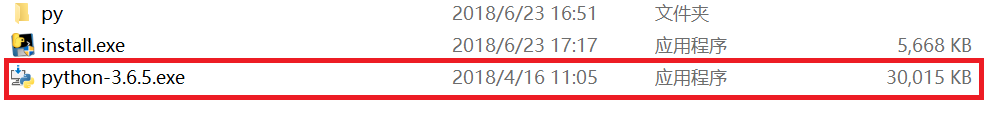

### 2.2. **按图勾选**

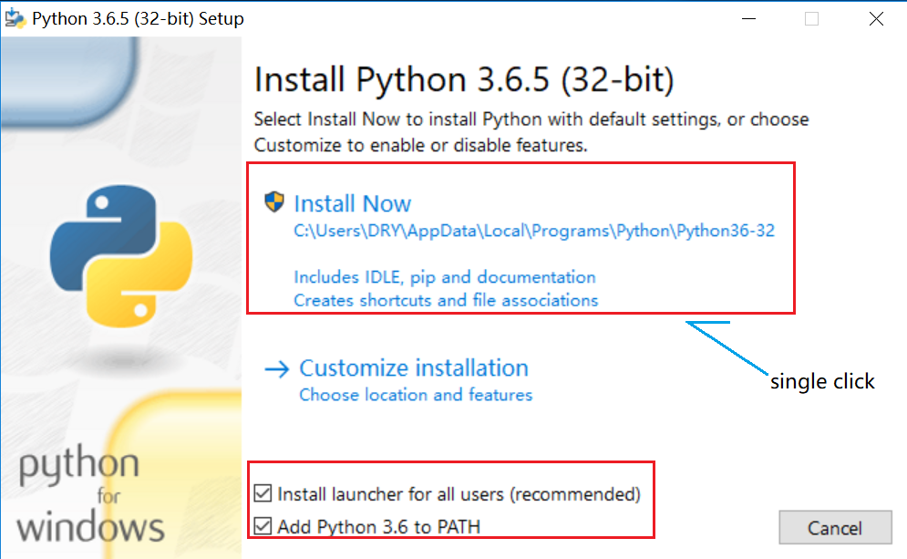

### 2.3. **等待安装**

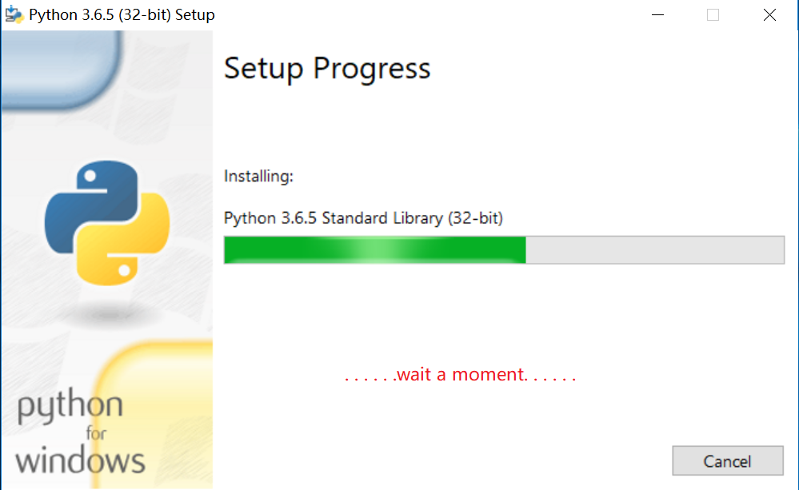

### 2.4. **关闭向导**

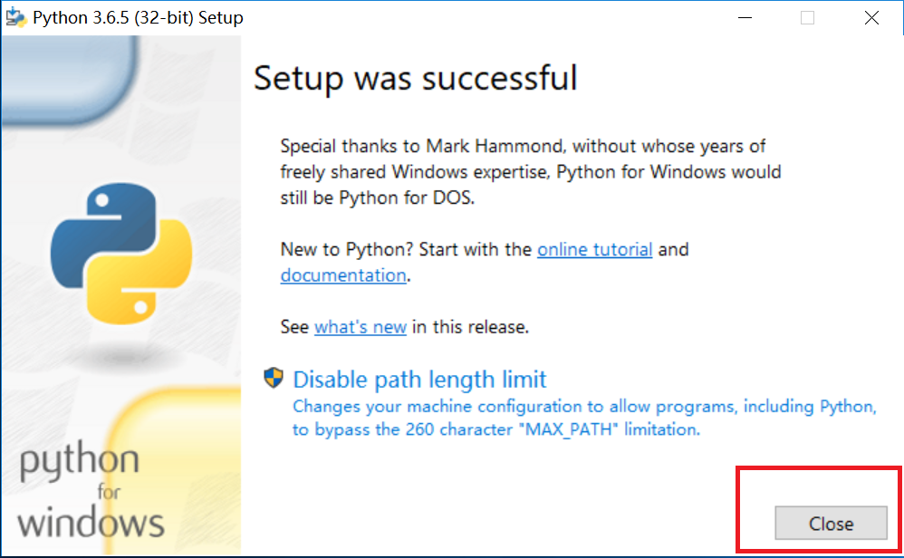

### 2.5. **检验安装**

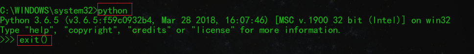

## 3. 安装模块
> 本软件在 `python标准库` 基础上还依赖几个第三方模块，具体安装步骤已经写成脚本并转化为可执行文件 `install.exe`

### 3.1. **双击目录下的 install.exe**

### 3.2. **按照提示复制且仅复制 `红色边框` 内的信息**

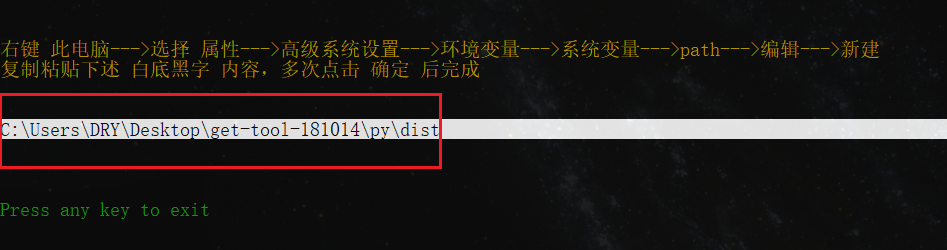

### 3.3. **添加环境变量-1**

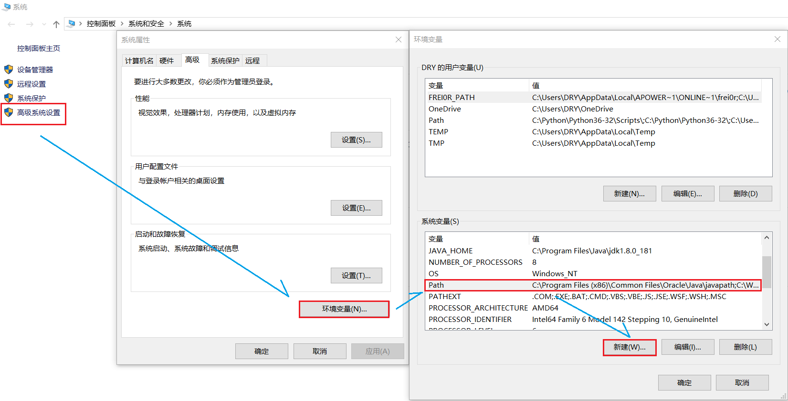

### 3.4. **添加环境变量-2**

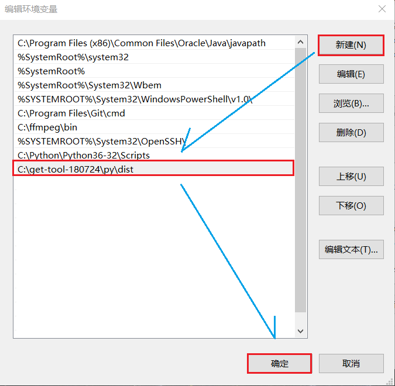

## 4. 使用详情

### 4.1. **打开 `命令行提示窗口` 的三种方法(任选其一,推荐第一种)**

- Win10:        `WIN+X` 弹出menu后键入 `A`
- Win10:        `WIN+X` 弹出menu后键入 `C`
- Win7/Win10:   `WIN+R` 然后输入 `cmd`

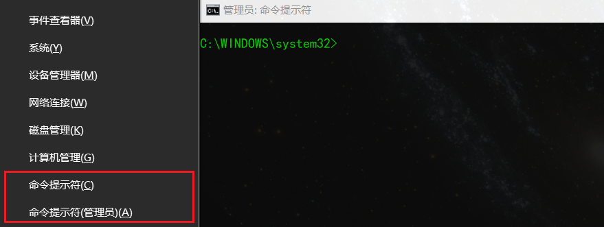

### 4.2. **命令行中输入 `get-more` 获取用法**

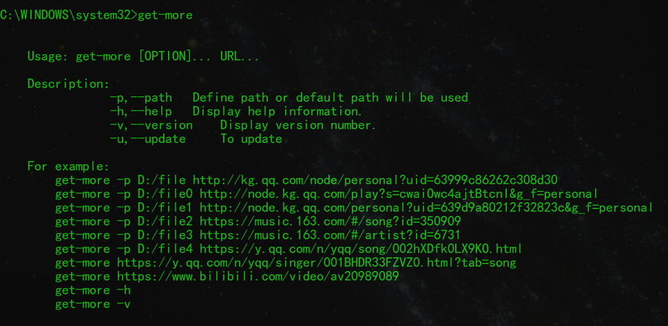

### 4.3. **使用效果大概这样**

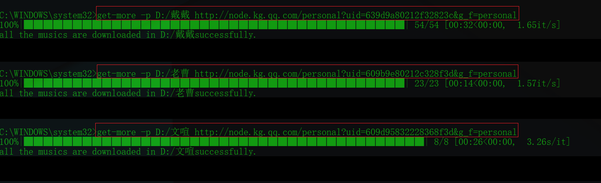

### 4.4. **可获得的 `网站-网址-下载方式` 如下**

- 全民K歌-歌手URL-批量下载 

- 全民K歌-歌曲URL-单曲下载 
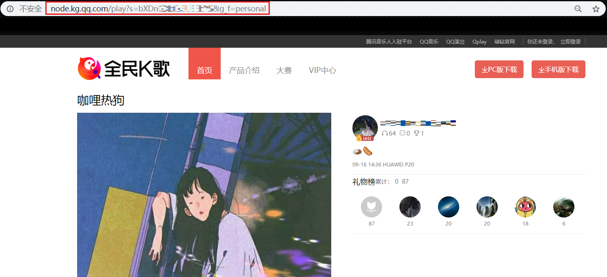

- 网易云音乐-歌曲URL-单曲下载 
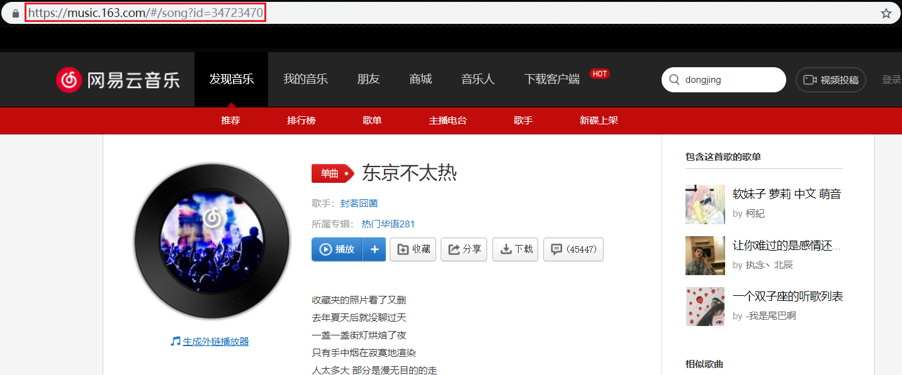

- 网易云音乐-歌手URL-批量下载 
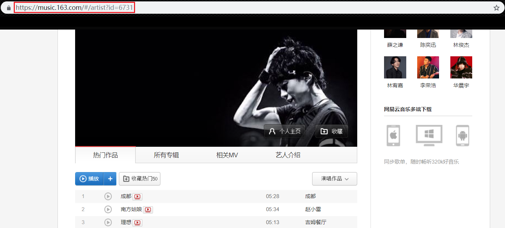

- QQ音乐-歌手URL-批量下载  
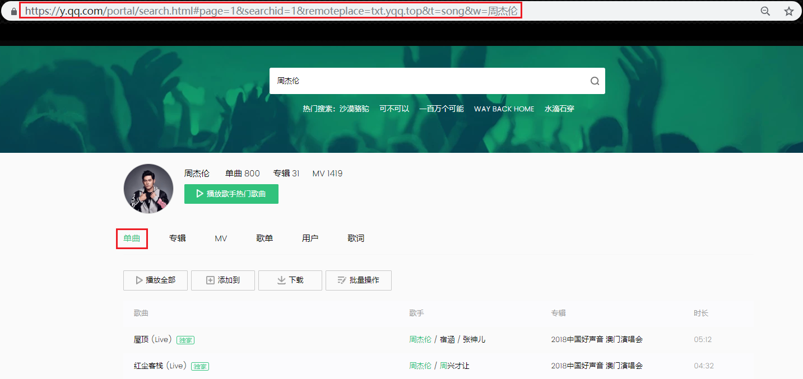

- QQ音乐-歌曲URL-单曲下载  

- Bilibili-视频URL-视频下载

- Youku-视频URL-视频下载
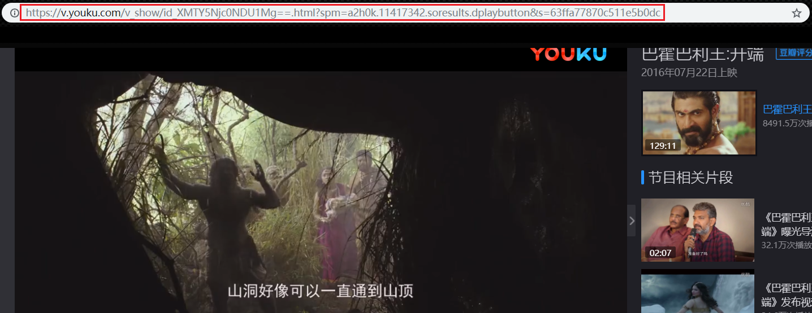

## 5. 声明

- **三家热门网站的音乐单曲与批量下载功能是笔者原创，视频下载功能的贡献来自github的开源项目 [you-get](https://github.com/soimort/you-get)，同时也是笔者灵感的来源与效法的对象。**

- **使用过程中出现任何bug欢迎反馈，邮箱如下：**
    - graycat0918@gmail.com
    - duruyao@outlook.com
 
- **强烈建议将Windows shell（或命令提示窗口）设置为黑底绿字，绿屏效应还是很酷的。**

- **本软件仅供python网络爬虫初学者入门学习借鉴之用，不得用于任何商业用途，不得传播盗版资源，不得侵犯持有版权的公司和创作者的任何利益......**
